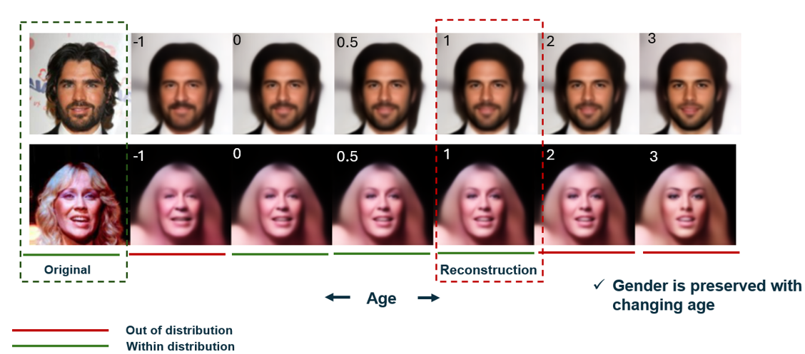

##  rotation title: Fair Image Generation Using Causal Discovery

This repository contains the code for a CNN adaptation of the $\beta$-Intact-VAE from the paper by [Wu et al. (2021)](https://arxiv.org/abs/2110.05225).


## Report Abstract
Causal inference based on counterfactuals can help answer questions to hypothetical scenarios such as ``How would this photo have looked if its subject were old instead of young?'' Deep learning frameworks, such as the variational autoencoder (VAE), have often been used to predict alternative outcomes by intervening on a learned latent space with counterfactual treatments. However, generative models such as these are susceptible to learning spurious correlations in training data, leading to unfair representations, such as discriminatory image generation. Recently, machine learning has been integrated with causal inference to mitigate the effects of statistical biases. By ensuring that the distributions of control variables (e.g. demographic attributes) overlap significantly with treatment conditions, deep generative models have been shown to produce fairer representations. In this lab rotation, a novel VAE was constructed to model a prognostic score for imaging data which is sufficient for treatment effect estimation. By extending the framework of the $\beta$-Intact-VAE to a convolutional network, a generative prognostic model was trained on the CelebA dataset to predict counterfactual outcomes for facial images. Under certain conditions, the model was able to produce fair representations under limited overlap between control variables and treatment conditions.





## Run info
Configure model hyperparameters using config.yml in root directory and train model using:

```
python train_vae.py
```

The model will be saved automatically and a copy of the config file will be made in ./Runs/

